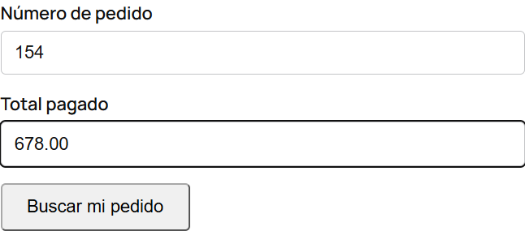
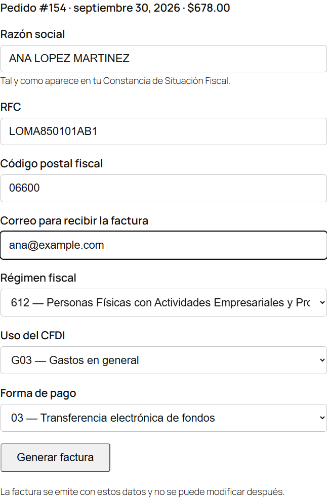
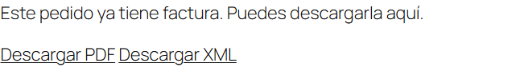
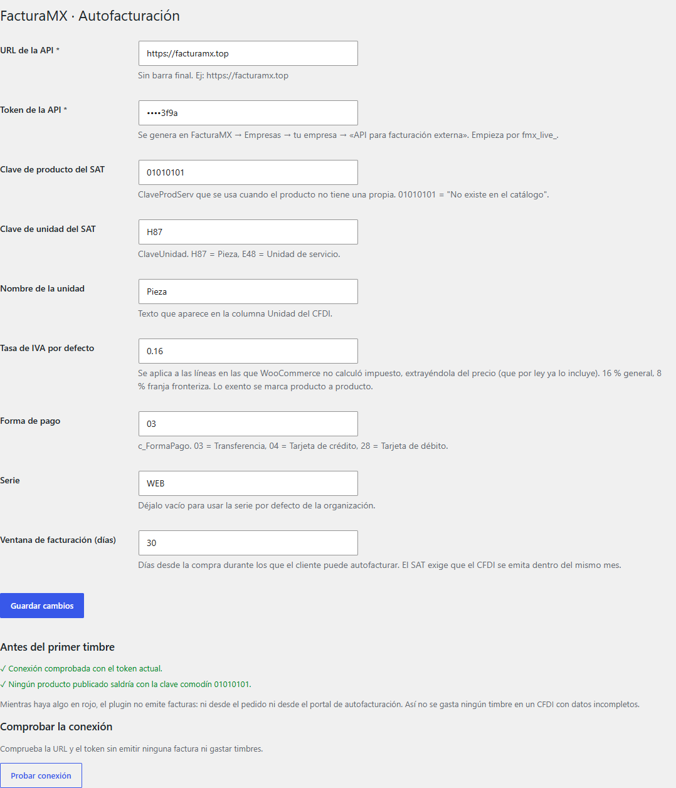
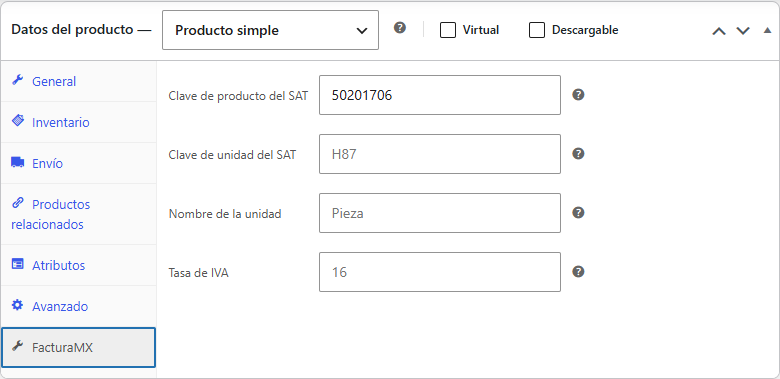
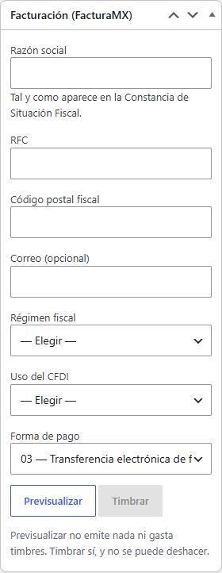

<p align="center">
  
</p>

# FacturaMX for WooCommerce

**Plugin gratuito de autofacturación CFDI 4.0 para tiendas WooCommerce en México, conectado a [FacturaMX](https://facturamx.top).**

Tus clientes generan **su propia factura** desde tu tienda: escriben su número de pedido, el total que
pagaron y sus datos fiscales, y reciben al instante su CFDI 4.0 con PDF y XML. Tú no haces nada.

> ### ⚠️ Necesitas una cuenta en FacturaMX
> Este plugin **no timbra por sí solo**: se conecta a **[FacturaMX](https://facturamx.top)**, la plataforma
> de facturación electrónica que emite y timbra tus CFDI ante el SAT. Crea tu cuenta en
> **[facturamx.top/register](https://facturamx.top/register)** — te regalamos **3 timbres** para probar.
>
> Guía completa y ayuda: **[facturamx.top/plugin-woocommerce](https://facturamx.top/plugin-woocommerce)**

---

## ¿Qué es FacturaMX?

[FacturaMX](https://facturamx.top) es una plataforma mexicana de facturación electrónica en la nube:
facturas CFDI 4.0, complementos de pago, cotizaciones, envío de facturas por correo y WhatsApp,
reportes, lectura de la Constancia de Situación Fiscal con IA, una **API** para conectar cualquier
sistema y este **plugin** para WooCommerce. Pagas solo por los timbres que usas.

## Cómo funciona para tu cliente

1. Entra a la página de facturación de tu tienda (la creas con la etiqueta `[facturamx_portal]`, en
   cualquier página o entrada de WordPress).
2. Escribe su **número de pedido** y el **total pagado**. Solo quien tiene el comprobante conoce los dos,
   así que no necesita cuenta en tu sitio.
3. Llena sus datos fiscales: **RFC, razón social, régimen fiscal, código postal fiscal, uso del CFDI,
   forma de pago** y su correo. Todo se valida contra los catálogos del SAT antes de timbrar.
4. Recibe su **CFDI 4.0** y descarga el **PDF y el XML** en ese momento.

| | | |
|:---:|:---:|:---:|
|  |  |  |
| Número de pedido y total | Datos fiscales del cliente | Factura con PDF y XML |

## Conectarlo con FacturaMX, paso a paso

1. **Crea tu cuenta** en [facturamx.top](https://facturamx.top/register).
2. En **Empresas**, da de alta tu empresa, sube tu **CSD** del SAT (.cer y .key) y firma la
   **Carta Manifiesto**. Con eso queda lista para timbrar.
3. En la ficha de tu empresa, en **«API para facturación externa»**, pulsa **Generar token**. Empieza
   por `fmx_live_` y se muestra una sola vez.
4. En WordPress, instala y activa **FacturaMX for WooCommerce** (necesitas WooCommerce activo).
5. Ve a **WooCommerce → FacturaMX**, pega el token, guarda y pulsa **Probar conexión**. Mientras la
   conexión no se haya probado con el token actual, el plugin no emite ninguna factura.
6. Asigna a cada producto su **clave del SAT** (ClaveProdServ) en su pestaña **FacturaMX**. El plugin no
   factura con la clave comodín `01010101` y la pantalla de ajustes te dice qué productos faltan.
7. Crea una página («Facturación», por ejemplo) con `[facturamx_portal]` y enlázala en el pie de tu sitio
   y en los correos de pedido.

| | | |
|:---:|:---:|:---:|
|  |  |  |
| Ajustes y «Antes del primer timbre» | Clave del SAT de cada producto | Facturar desde el pedido |

## Qué hace

- **Página pública de autofacturación** con la etiqueta `[facturamx_portal]`.
- **Facturar desde el pedido** en el administrador de WooCommerce, con previsualización que no timbra, o
  **enviarlo a FacturaMX como cotización** para convertirlo en factura desde el panel.
- **La factura le llega al cliente por correo**, con el PDF y el XML, si deja su email.
- **IVA incluido, como marca la ley:** si WooCommerce no calculó el impuesto de una línea, el plugin lo
  extrae del precio en vez de sumarlo. Los productos exentos se declaran uno por uno.
- **Cuadra el CFDI contra lo pagado**; si no cuadra, no lo emite.
- **Un pedido no se factura dos veces**, aunque el cliente pulse el botón de nuevo o el comercio ya lo
  haya facturado desde el panel de FacturaMX: el portal lo detecta y ofrece la descarga.
- **Configuración guiada:** no timbra con la conexión sin probar ni con productos sin clave del SAT.
- El PDF y el XML se descargan desde tu propio sitio: **tu token nunca llega al navegador**.
- Compatible con **HPOS** (almacenamiento de pedidos de alto rendimiento).

## Precio

El plugin es **gratuito** y de código abierto (GPL-2.0-or-later). Cada factura que emite usa **un timbre**
de tu cuenta de FacturaMX: 3 gratis al registrarte y después paquetes en
[facturamx.top](https://facturamx.top).

## Requisitos

- WordPress 6.0+ · WooCommerce 8.0+ · PHP 8.0+
- Tienda en pesos mexicanos (MXN).
- Cuenta en [FacturaMX](https://facturamx.top) con CSD cargado y token de API.

Probado con WordPress 7.1 y WooCommerce 11.1.

## ¿Otro sistema, no WooCommerce?

FacturaMX tiene una **API REST** para conectar tu ERP, punto de venta o cualquier sistema: timbrar,
consultar, descargar y enviar facturas. Crea tu cuenta y la encuentras en el menú **API**, con su manual.

## Privacidad y servicio externo

El plugin envía a FacturaMX solo lo necesario para emitir la factura que se pide (datos fiscales del
receptor y conceptos del pedido). Detalle en el `readme.txt` y en los
[términos](https://facturamx.top/terminos) y el [aviso de privacidad](https://facturamx.top/privacidad)
de FacturaMX.

## Desarrollo

```bash
php facturamx-for-woocommerce/tests/run-tests.php   # tests (sin WordPress)
php scripts/lint.php                                  # sintaxis PHP
php scripts/build.php                                 # zip listo para instalar, en dist/
```

La carpeta `.wordpress-org/` tiene el icono, el banner y las capturas del directorio de WordPress.

## Soporte

- Web: [facturamx.top](https://facturamx.top) · [Guía del plugin](https://facturamx.top/plugin-woocommerce)
- Correo: [contacto@facturamx.top](mailto:contacto@facturamx.top)
- WhatsApp: [961 451 3696](https://wa.me/5219614513696)

---

Hecho por [FacturaMX](https://facturamx.top) · Facturación electrónica simple y rápida.
